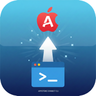

#  asc-cli

**App Store Command Center** — inspired by the Terran Command Center from StarCraft.

[](https://github.com/tddworks/asc-cli/actions/workflows/ci.yml)
[](https://codecov.io/gh/tddworks/asc-cli)
[](https://swift.org)
[](https://www.apple.com/macos/)

A CLI for App Store Connect — automate builds, releases, TestFlight, subscriptions, and screenshots from your terminal or CI pipeline. Outputs structured JSON so AI agents can drive the full release workflow.

## Quick Start

You need an App Store Connect API key ([create one here](https://appstoreconnect.apple.com/access/integrations/api)).

```bash
brew install asccli

asc auth login \
  --key-id YOUR_KEY_ID \
  --issuer-id YOUR_ISSUER_ID \
  --private-key-path ~/.asc/AuthKey_XXXXXX.p8

asc apps list          # find your app ID
asc init --app-id <id> # pin it — skip --app-id on every future command
```

Multiple accounts, environment variables for CI: [auth](docs/features/asc-auth/README.md). Building from source: [CONTRIBUTING.md](CONTRIBUTING.md).

## Built for Agents: CAEOAS

REST has **HATEOAS** — responses embed URLs so clients navigate without knowing the API. asc has **CAEOAS** (Commands As the Engine Of Application State): every response embeds ready-to-run commands, so an agent navigates without memorising the command tree.

```jsonc
// asc versions list --app-id app-abc
{
  "id": "v1",
  "versionString": "2.1.0",
  "state": "PREPARE_FOR_SUBMISSION",
  "isEditable": true,
  "affordances": {
    "listLocalizations": "asc version-localizations list --version-id v1",
    "checkReadiness":    "asc versions check-readiness --version-id v1",
    "submitForReview":   "asc versions submit --version-id v1"  // only when isEditable == true
  }
}
```

JSON is the default; add `--output table` or `--output markdown` for people, or run `asc tui` to browse interactively. `asc web-server` serves the same commands as a REST API. More in [docs/design.md](docs/design.md).

## What It Covers

| Area | What you can do |
| --- | --- |
| **Apps & Versions** | Set the app's price or make it free, create versions, link builds, pre-flight checks, submit for review — with first-time IAPs and subscriptions in the same submission → [pricing](docs/features/app-pricing/README.md) · [readiness](docs/features/version-check-readiness/README.md) · [submit with products](docs/features/submit-with-products/README.md) · [review submissions](docs/features/review-submissions/README.md) |
| **Builds** | Archive Xcode projects, export IPA/PKG, upload, set encryption compliance → [archive](docs/features/builds-archive/README.md) · [upload](docs/features/builds-upload/README.md) |
| **TestFlight** | Beta groups, testers (CSV import/export), beta review, per-locale beta app description → [testflight](docs/features/testflight/README.md) · [beta review](docs/features/beta-review/README.md) · [beta localizations](docs/features/beta-app-localizations/README.md) |
| **Metadata** | What's New, description, keywords; name, subtitle, privacy policy; categories; age rating; review contact → [version localizations](docs/features/version-localizations/README.md) · [app info](docs/features/app-infos/README.md) · [age rating](docs/features/age-rating/README.md) · [review detail](docs/features/version-review-detail/README.md) |
| **Screenshots & Previews** | Screenshot sets and uploads, video previews → [screenshots](docs/features/screenshots/README.md) · [previews](docs/features/app-previews/README.md) |
| **App Shots** | AI screenshot generation: templates, gallery sets, plugin themes, Gemini enhancement → [app shots](docs/features/app-shots/README.md) · [themes](docs/features/app-shots-themes/README.md) |
| **Monetization** | IAPs, subscriptions, intro/promotional/win-back offers, offer codes, per-territory pricing, promoted purchases, availability → [IAP & subscriptions](docs/features/iap-subscriptions/README.md) · [promoted purchases](docs/features/promoted-purchases/README.md) · [availability](docs/features/iap-subscription-availability/README.md) |
| **Product Page Optimization** | A/B test your product page with alternate icons → [experiments](docs/features/product-page-optimization/README.md) |
| **Code Signing** | Bundle IDs, certificates, devices, provisioning profiles → [code signing](docs/features/code-signing/README.md) |
| **Customer Reviews** | Read reviews and respond → [reviews](docs/features/customer-reviews/README.md) |
| **Team** | Members, roles, invitations → [users](docs/features/asc-users/README.md) |
| **Xcode Cloud** | Products, workflows, start and inspect builds → [xcode cloud](docs/features/xcode-cloud/README.md) |
| **Insights** | Sales, finance and analytics reports; performance metrics and diagnostics → [reports](docs/features/reports/README.md) · [performance](docs/features/performance/README.md) |
| **App Clips & Game Center** | App Clip experiences; achievements and leaderboards → [app clips](docs/features/app-clips/README.md) · [game center](docs/features/game-center/README.md) |
| **Iris (private API)** | Web-UI features with no public API: create apps, read App Review's rejection messages → [iris](docs/features/iris/README.md) · [resolution center](docs/features/resolution-center/README.md) |
| **Extend** | Plugins, skills, local simulators, REST server → [plugins](docs/features/plugins/README.md) · [skills](docs/features/skills/README.md) · [simulators](docs/features/simulators/README.md) · [REST API](docs/features/rest-api/README.md) |

Every feature, one line each: [docs index](docs/README.md). Every command and flag: [command reference](docs/commands.md) or `asc <command> --help`.

## More

- [Release workflow](docs/release.md) — upload → TestFlight → submit, end to end
- [Use as a Swift package](docs/library.md) — embed `ASCKit` in your own tool
- [Contributing](CONTRIBUTING.md) — build, test, and where things go
- [Changelog](CHANGELOG.md)

## Sponsors

Apps that use and support asc-cli development:

<a href="https://appnexus.app">
  
  <br>
  <b>AppNexus for App Store Connect</b>
</a>

## App Wall

Apps built and published using asc-cli. To add yours, edit [`homepage/apps.json`](homepage/apps.json) and open a pull request — see [docs/features/app-wall/README.md](docs/features/app-wall/README.md) for the format. View the live wall at [asccli.app/#app-wall](https://asccli.app/#app-wall).

## License

Apache License 2.0. See [LICENSE](LICENSE) and [NOTICE](NOTICE).
